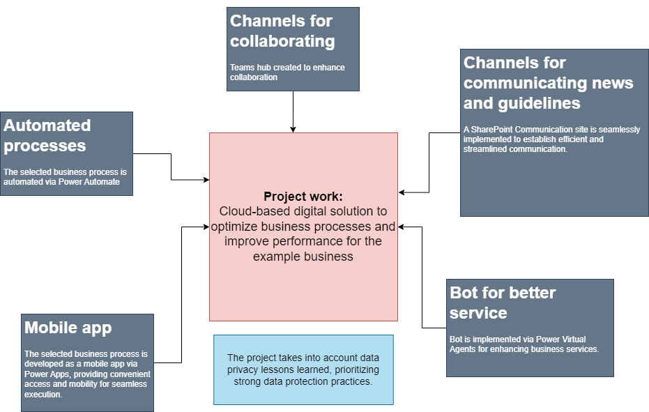

# Microsoft platform Cloud-Based Business Solutions

## During this project, I could... :
- Get familiar and evaluate different types of cloud-based business solutions and how these solutions enhance business value for the company
- Earn and comply with different data protection and privacy related issues
- Design and implement given cloud-based business solutions while taking into account company requirements.

**Project overview:**

**Example of My Application in Microsoft 365 PowerApps:**

https://github.com/user-attachments/assets/62b24e39-9aa6-42d7-940e-e3551bcb78f0

